# a11g-final-submission

**Team Number: 16**

**Team Name: Edge Vibe**

| Team Member Name | Email Address           | GitHub Username |
| ---------------- | ----------------------- | --------------- |
| Aktilek Skakova  | skakova@seas.upenn.edu  | skakova-aktilek |
| Yuhan Wang       | yyhhwang@seas.upenn.edu | yhwang0523      |

**GitHub Repository URL:**

## 1. Video Presentation

## 2. Project Summary

##### **Device Description**

Our device is an interactive spelling and learning system designed to help users practice word recognition and spelling through visual and audio feedback. It integrates sensors, display, and cloud connectivity to create an engaging learning experience.

The project was inspired by the need for simple, interactive educational tools that can provide immediate feedback. It aims to improve spelling skills while making the learning process more engaging.

We use the Internet via Node-RED and a cloud-hosted dashboard to monitor system states, display target words, and log user performance in real time.

##### **Device Functionality**

The device is an interactive spelling and learning system built on a Wi-Fi-enabled microcontroller (SiWG917Y121MGABA). It communicates with a Node-RED server to receive target words and send user performance data. The system provides real-time visual and audio feedback through an OLED display and a web-based dashboard.

Users interact with the system through letter cubes, physical buttons and a cloud interface. The device displays target words, tracks user input, provides correctness feedback, and logs errors for later analysis via the Node-RED dashboard.

    Key components:   SiWG917Y for Wi-Fi connectivity and system control

    Actuators: OLED Display: FeatherWing 128x64 OLED (SH1107)

    Sensors: Ambient Light Sensor (VEML7700)

    User Input:

    Buttons: Used for navigating, selecting, and inputting characters

    Letter cubes: Used for spelling words.

    Cloud / Interface: Node-RED Dashboard (Azure-hosted).

    Displays current target word, user input, system status, and logs spelling errors in real time.

    System Block Diagram:

##### **Challenges**

1. We initially planned to use four digital multiplexers, connecting a total of 16 GPIO pins (4×4). Although we carefully reviewed the datasheet and confirmed these pins were available, we overlooked a small note indicating that several of the selected GPIOs on the SiWG917Y121 are specifically reserved for flashing purposes and should not be used for general I/O. As a result, one of the multiplexers could not function properly.

* To address this issue, we chose not to use the affected multiplexer and proceeded with only three multiplexers. As a result, the system supports input for 16 letters instead of the originally planned configuration.

2. The LED strip we originally planned to use required a protocol similar to SPI communication and demanded a higher signal voltage (~4.2V), while our MCU only provides a 3.3V output. This requirement was not clearly stated in the datasheet, and we only discovered it after referencing external implementation examples.

* To resolve this, we removed the LED strip from our design and instead implemented a software-based solution by displaying ambient light intensity on the dashboard. When the light level falls below a threshold, the system provides a reminder for the user to turn on the lights.

3. We initially planned to use a 5V passive piezo buzzer. However, the component was not in stock, which required us to switch to a magnetic buzzer instead. This change also required modifications to the circuit design.

* We updated the circuit by removing the previously designed diode and resistor and adapted the driving method to match the requirements of the magnetic buzzer.

##### **Prototype Learnings**

###### **Lessons Learned**

* Learned how to manage multiple I2C devices on a shared bus by properly assigning and handling device addresses to ensure reliable communication.
* Gained experience with RTOS task scheduling and resource management, which helped reduce resource waste and prevent system blocking or task stalling.
* Learned the importance of carefully reviewing both MCU and external component datasheets during PCB design. Missing critical details such as pin functions, internal constraints, communication protocols, and voltage/current requirements can lead to significant integration issues.###### **What We Would Do Differently**
* Choose an LED strip that is fully compatible with the MCU to achieve our original goal of dynamically adjusting brightness based on ambient light intensity.
* Reassign GPIO pins for the multiplexers more carefully to avoid restricted or special-purpose pins and ensure full functionality.
* Use heavier and more robust materials for the 3D-printed letter blocks to improve contact reliability and recognition accuracy.

##### **Next Steps**

Improve hardware reliability by selecting components that are better matched to the MCU, especially for LED control and GPIO usage. Add more advanced features such as adaptive difficulty and improved interaction logic.

##### **Takeaways**

Through ESE5160, I learned how to design and build a complete embedded system from the ground up, integrating PCB design, firmware development, and cloud-based interfaces. The course strengthened my understanding of hardware-software co-design and exposed me to real-world challenges such as limited resources, peripheral integration, and system-level debugging.

## 3. Hardware & Software Requirements

##### Hardware Requirements (HRS)

* **HRS-01:** The SiWG917Y MCU successfully handled system control and Wi-Fi communication.
* **HRS-02:** The system supports 16 letters instead of 26 due to GPIO limitations and multiplexer constraints.
* **HRS-03:** Digital multiplexer and letter decoding worked reliably for the supported inputs.
* **HRS-04:** The ambient light sensor functioned correctly and data was displayed on the dashboard with low-light alerts.
* **HRS-05:**  OLED display worked, showing simple animation according to the user input.
* **HRS-06:** The magnetic buzzer provided reliable audio feedback for system events.
* **HRS-07:** Base lighting was not implemented and was replaced with a dashboard-based feedback mechanism.
* **HRS-08:** Control buttons functioned correctly after redesign and simplification.

##### Software Requirements (SRS)

* **SRS-01:** Letter tile detection latency met the ≤100 ms requirement during testing.
* **SRS-02:** Letter encoding and recognition worked correctly for the supported 16-letter subset.
* **SRS-03:** The system correctly validated user input against the target word.
* **SRS-04:** Feedback was provided within the required 500 ms timeframe.
* **SRS-05:** The OLED display reliably showed target words and system status.
* **SRS-06:** Wi-Fi communication with the Node-RED dashboard worked successfully for data exchange.

## 4. Project Photos & Screenshots

**Final project**

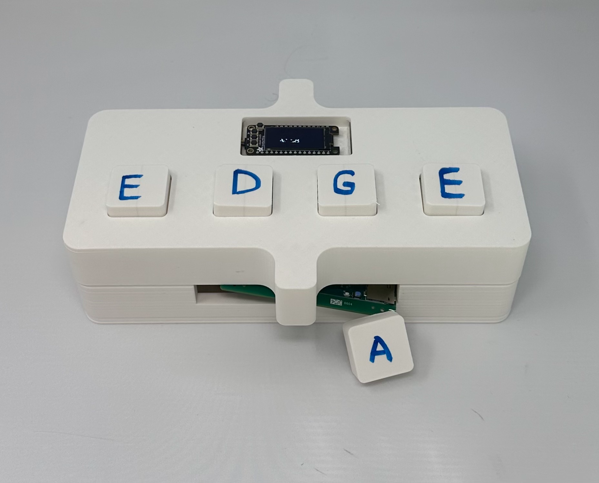

**3D Print**

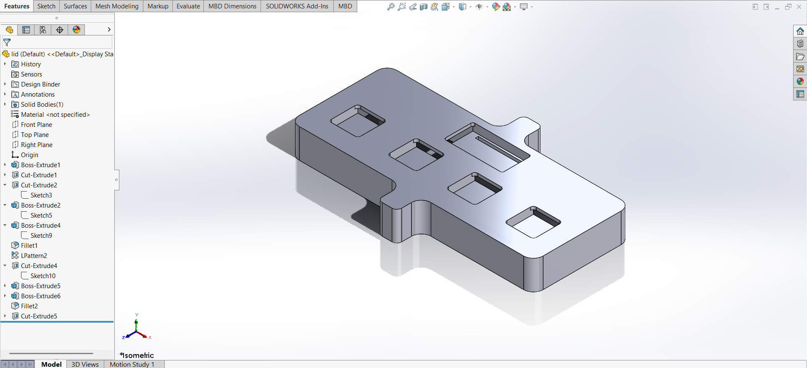

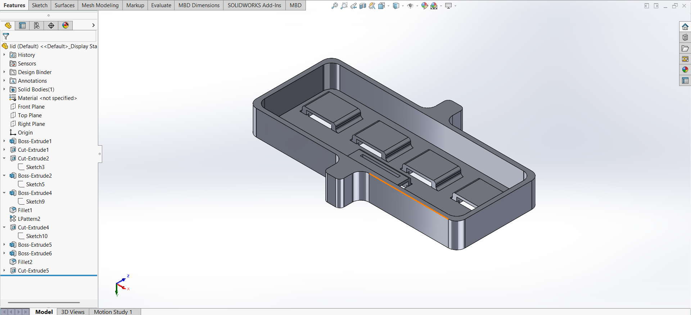

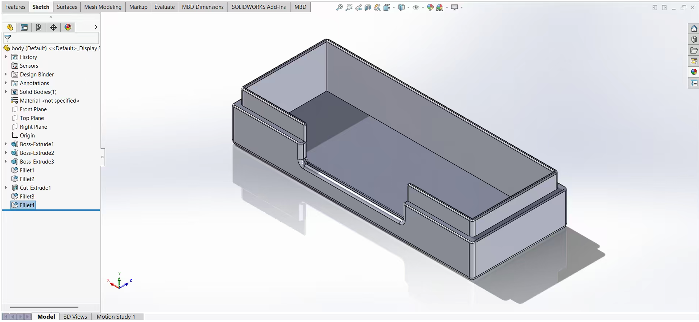

**PCBA, top**

**PCBA, bottom**

**Thermal camera images**

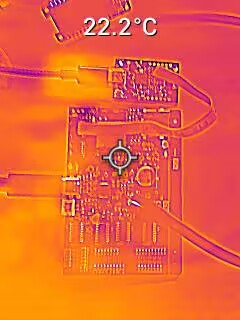

**Altium Board design in 2D view**
(1) All Layers

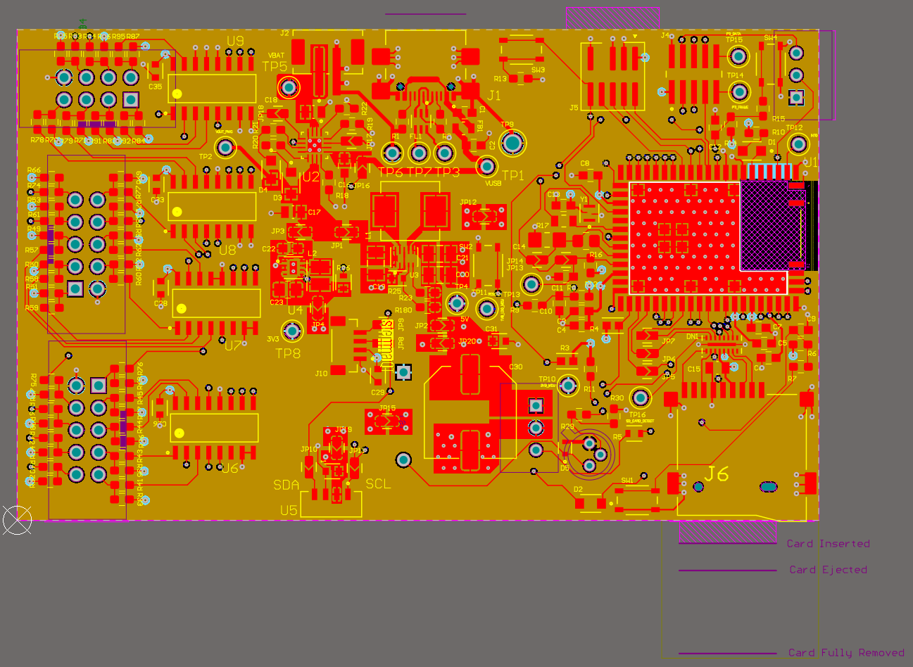

Flipped

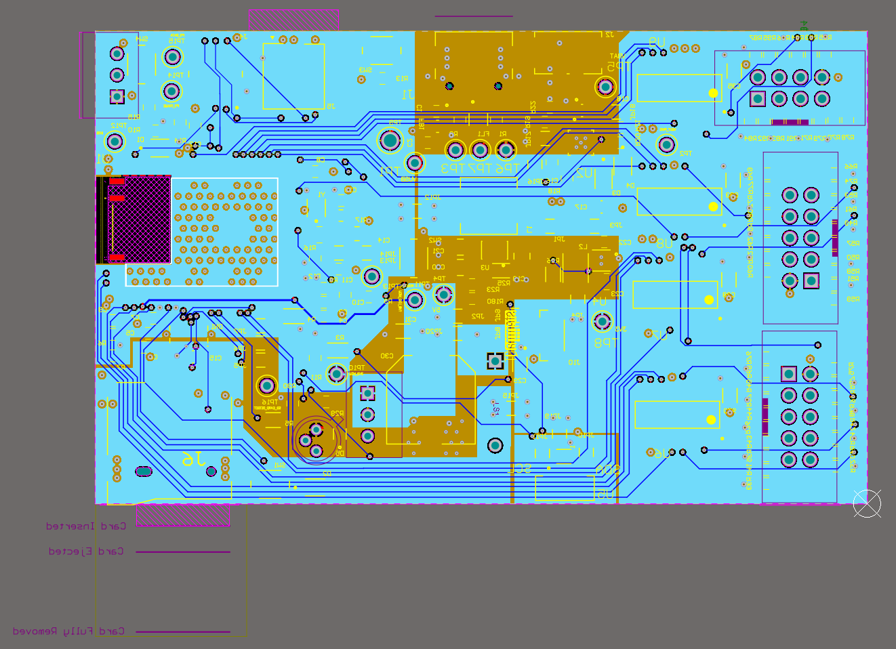

(2) Top Layer

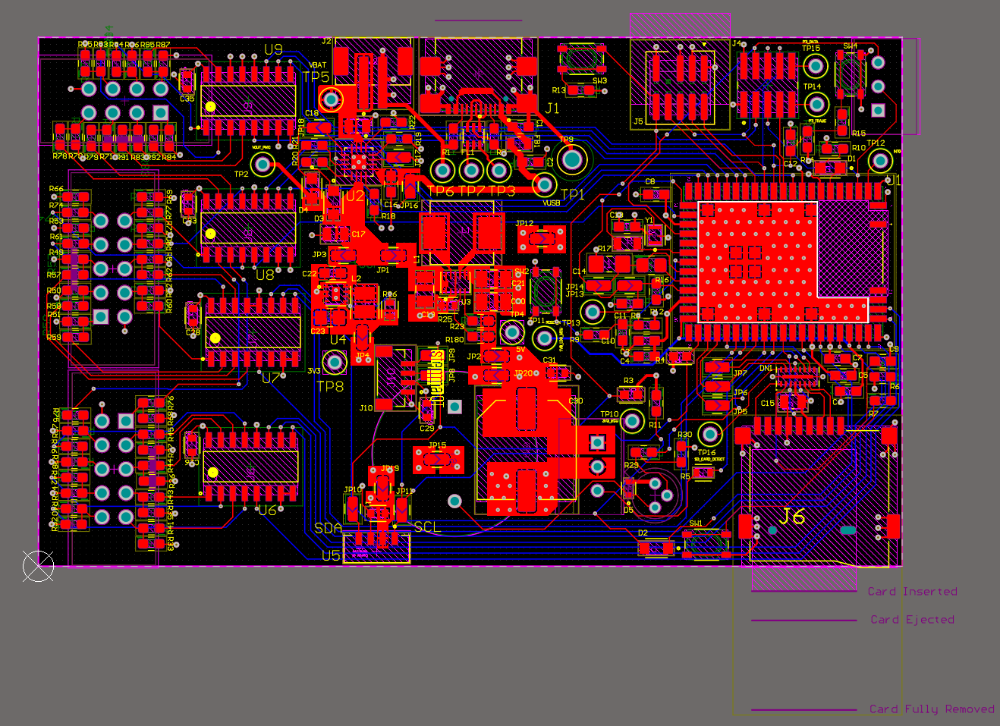

(3) Bottom Layer

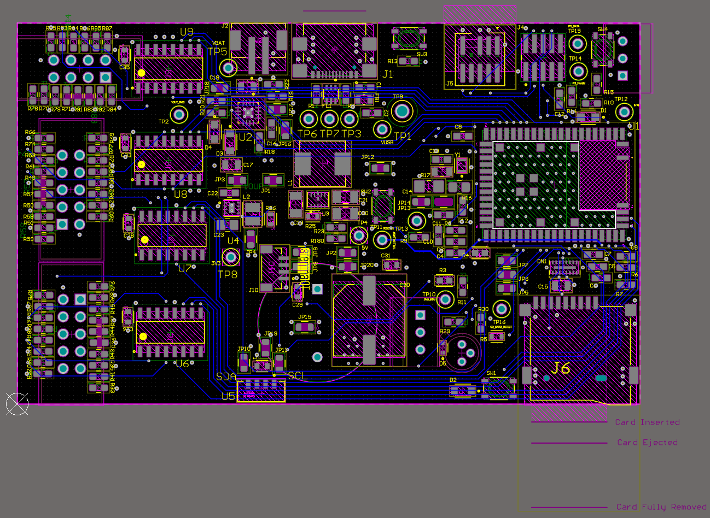

Note: Middle two layers used for polygon pours – power and ground planes

**Altium Board design in 3D view**

top
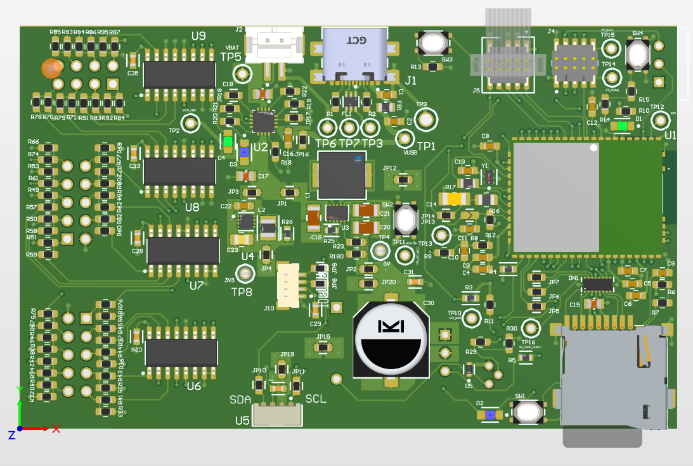

bottom

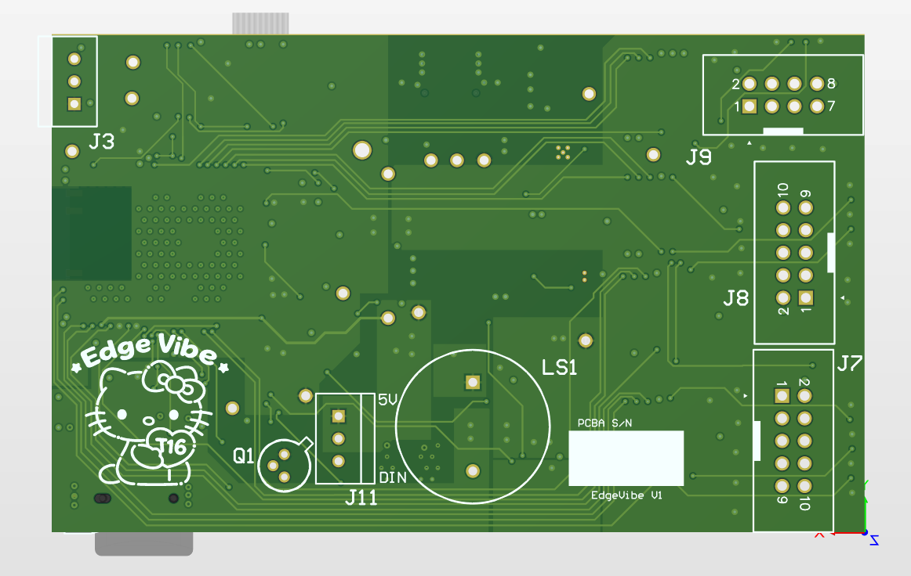

**Node-RED dashboard**

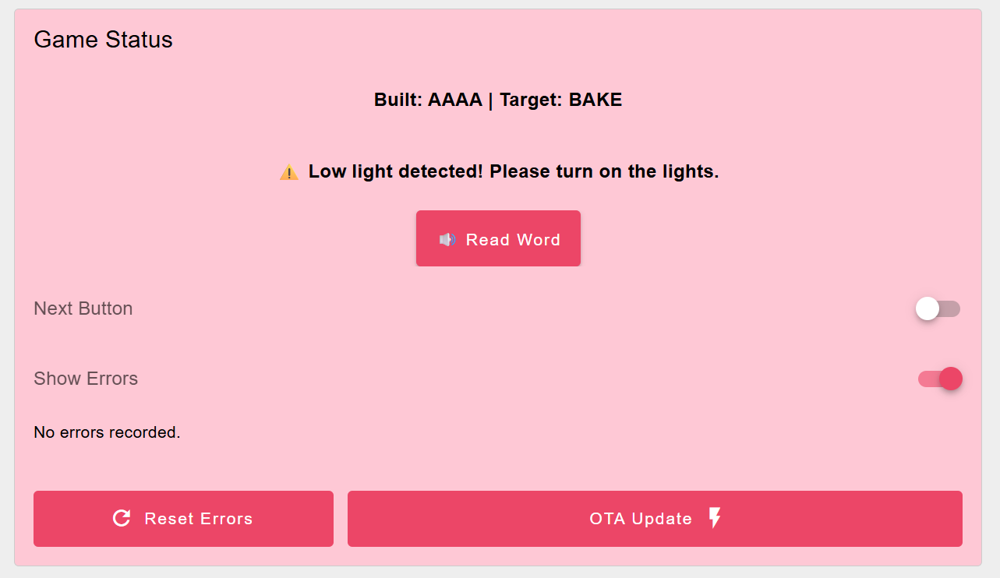

**Node-RED backend**

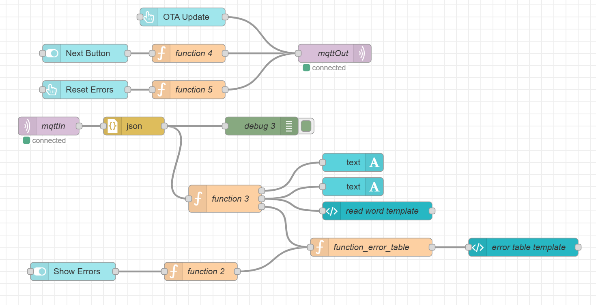

**Block diagram**

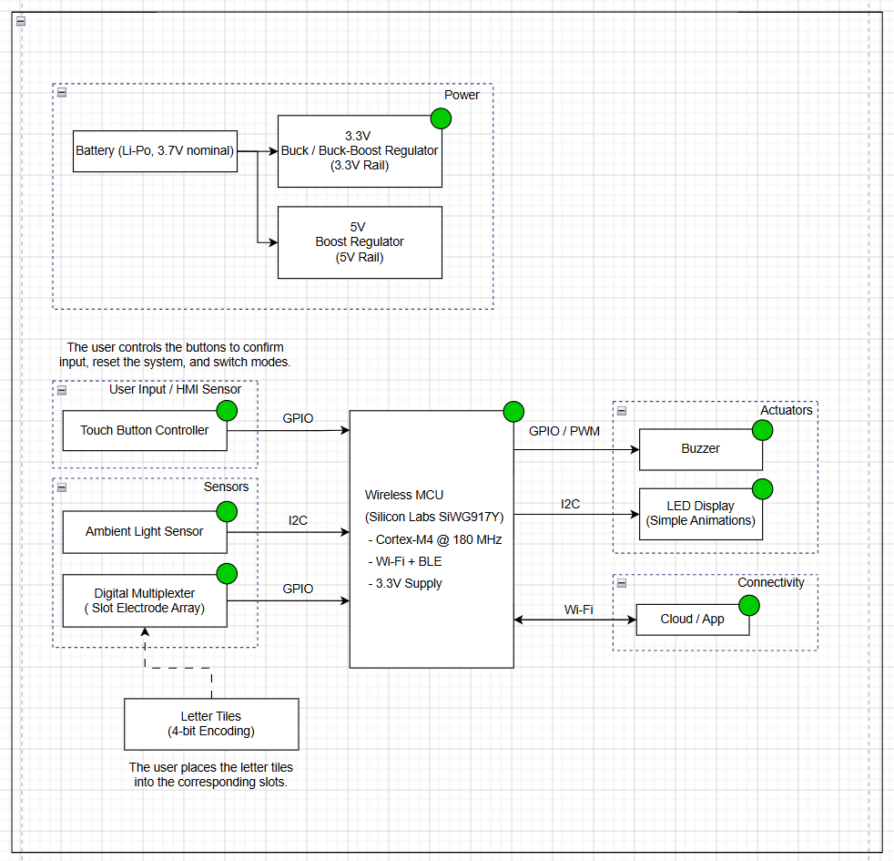

## 5. Codebase

Do *not* commit any of your source code to this repository. Rather, provide links to the other GitHub repository you've already been using with your firmware.

- A link to your final embedded C firmware codebases
- A link to your Node-RED dashboard code
- Links to any other software required for the functionality of your device
